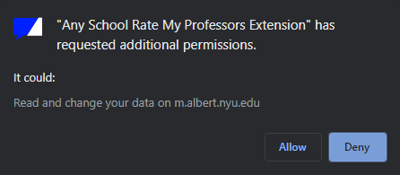
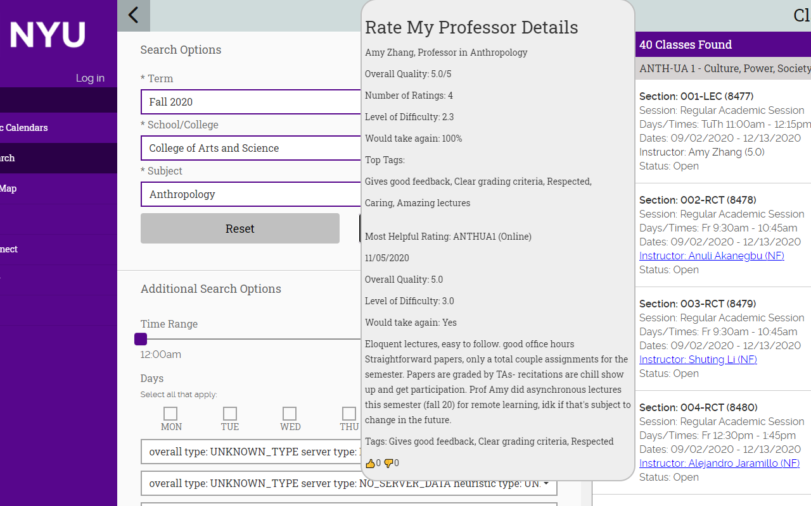
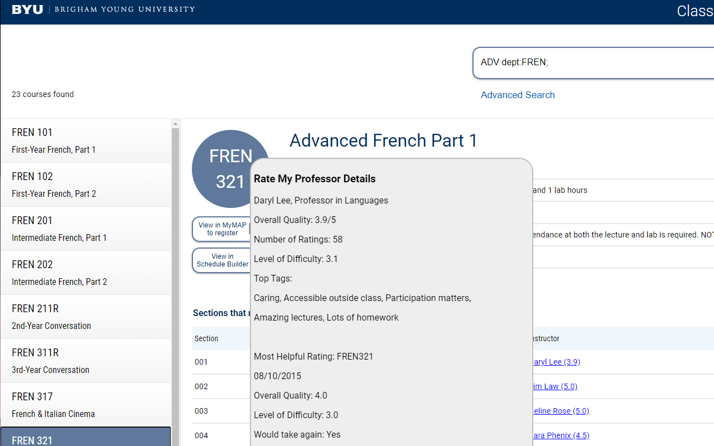

# Multi-College-Rate-My-Professor-Extension

[**Chrome** extension][link-chrome] [][link-chrome]

This extension shows the [Rate My Professors](https://www.ratemyprofessors.com/) rating of professors while searching classes on websites provided in a community-edited Airtable. 

### Description
Professors' names will now link to their Rate My Professors page (or the search results if not found). The most helpful rating is chosen as the most recent rating with the most net upvotes (regardless of the quality given). (The most helpful rating on Rate My Professors always has an "Awesome" overall quality.) Also, the "Would take again" value won't show up unless there are eight or more ratings and the majority of ratings answer that question. 

To better find professors, this extension will try the first part of a hyphenated last name, removing middle names, the middle name as the first name (common Southern tradition), and the middle name as the last name (maiden name/Spanish surname). It will also try all associated nicknames or diminutive names for first names from [here](https://github.com/carltonnorthern/nickname-and-diminutive-names-lookup). This extension also works with "last name, first name" notation and first initials.

### Setup
- Install this extension.
- Check if your college class search website is already in the [Airtable](https://airtable.com/shrLerMYO0zwwLasr).
- If not, the edit link to the Airtable is [here](https://airtable.com/invite/l?inviteId=inv3Tecc8DWRnj58K&inviteToken=4f05cad586fc2b0ef1f9e95a814ce1be2ceacd835b93aac5c23b8ff9532566bc). Note: You must create an Airtable account if you don't have one to edit.
- Fill in the required fields to add your college's class search website. Read the field descriptions to help you.
- Go to the URL of the college class search website you just added.
- If the extension icon is not lit up, click on it to refresh the supported URL's. (Give Airtable a bit to update changes on its end.) Click on the lit up icon and give the extension permissions to the website.
- The page will refresh and professors ratings will be shown on the page.
- Changes from the Airtable will be reflected whenever you click on the extension icon.

### Todo
- Support search given only a last name
- Support iframes
- Handle multiple professor names in one element
- Search multiple colleges in URL

### Screenshots

[link-chrome]: https://chrome.google.com/webstore/detail/multi-college-rate-my-pro/kkppfcnjkdgeocghmebigakljcpiamge?hl=en&authuser=0 "Version published on Chrome Web Store"
